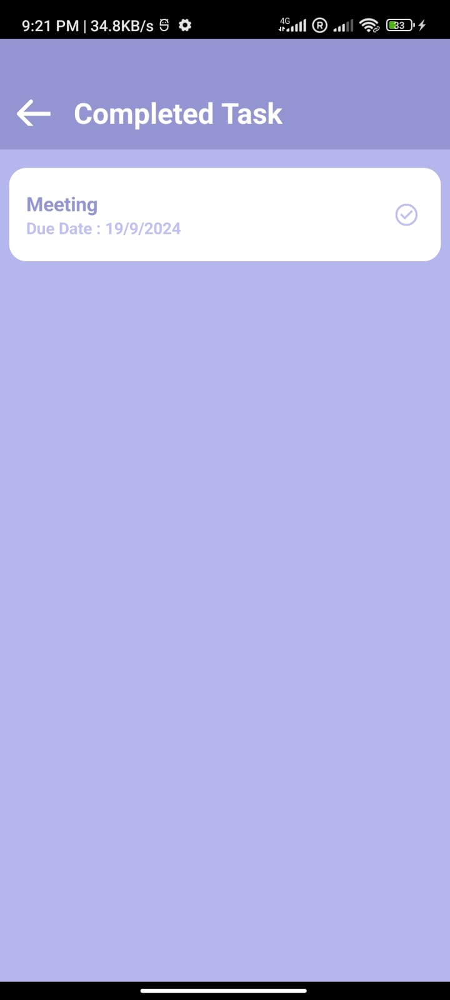

# ToDoList App

A simple, efficient, and user-friendly **ToDoList application** designed to help you manage your tasks effectively. This app allows users to create, update, delete, and track the progress of their daily tasks. Built with React Native, it offers a seamless and intuitive user experience.

## Features

- **Add tasks**: Easily add tasks with just a few clicks/taps.
- **Edit tasks**: Modify tasks when priorities or details change.
- **Delete tasks**: Remove tasks that are no longer relevant.
- **Mark tasks as completed**: Keep track of your progress by marking tasks as done.
- **Task filter**: View tasks by categories such as pending, completed, or all tasks.
- **Responsive design**: Optimized for all Mobile.
- **Data persistence**: Uses [Local Storage-Realm] to store and retrieve tasks.

## Screenshots

  
  
  
  

## Tech Stack

- **Frontend**: React Native
- **Database**: Realm
- **Testing Framework**: Jest
- **Design Tool**: Figma

